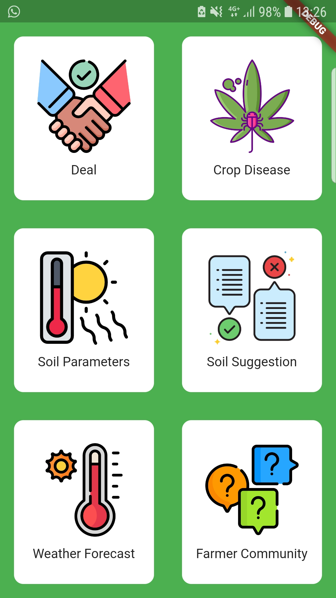

# NeelaKuruvi

Contract Farming app using Data Analytics.

## Technologies used
Tensorflow  
Flutter  
SVM  
Firebase  

## Developers

Justin John Mathew <a href="https://www.linkedin.com/in/justinjmathew">(LinkedIn)</a> (Backend Engineer)  
Alan Henry <a href="https://www.linkedin.com/in/alanrhenry/">(LinkedIn)</a> (Frontend Engineer)  
Sachin Vilas Nagane <a href="https://www.linkedin.com/in/sachin-vilas-nagane/">(LinkedIn)</a> (Backend Engineer)  
Naveen Sreevalsan <a href="https://www.linkedin.com/in/naveensreevalsan/">(LinkedIn)</a> (Backend Engineer)  
Joel Mathew Koshy <a href="https://www.linkedin.com/in/joel-mathew-koshy/">(LinkedIn)</a> (Frontend Engineer)  

